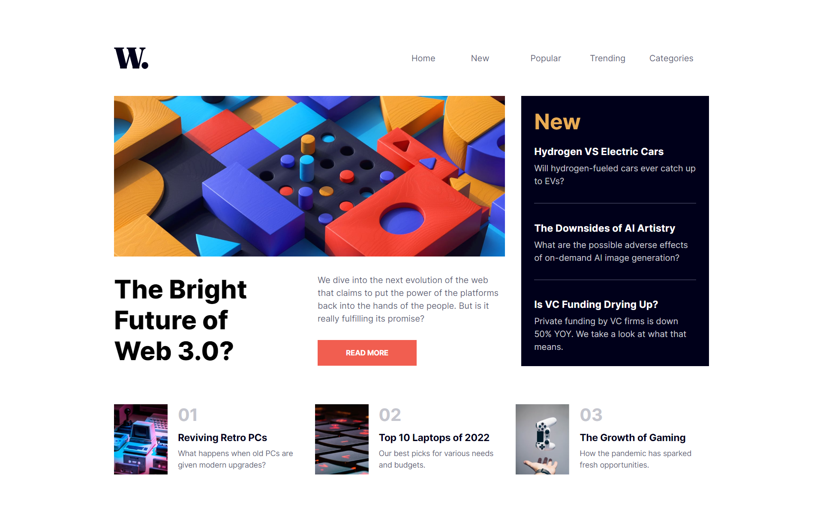
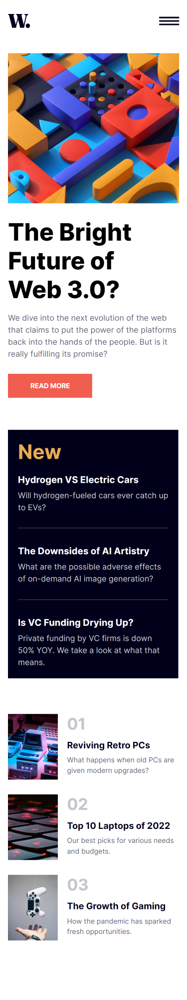

# Frontend Mentor - Blog preview card solution

This is a solution to the [News homepage challenge on Frontend Mentor](https://www.frontendmentor.io/challenges/news-homepage-H6SWTa1MFl). Frontend Mentor challenges help you improve your coding skills by building realistic projects. 

### Screenshot

### Links

- Live Site URL: [New Homepage](https://trilok2703.github.io/news-homepage/)

## My process

### Built with

- Semantic HTML5 markup
- CSS custom properties
- Flexbox
- Javascript

### Useful resources

- [root css](https://developer.mozilla.org/en-US/docs/Web/CSS/:root) - For using global variables for colors by setting it in the root selector.

## Author

- Website - [Trilok Vallamkonda](https://github.com/trilok2703/)
- Frontend Mentor - [@trilok2703](https://www.frontendmentor.io/profile/trilok2703)
